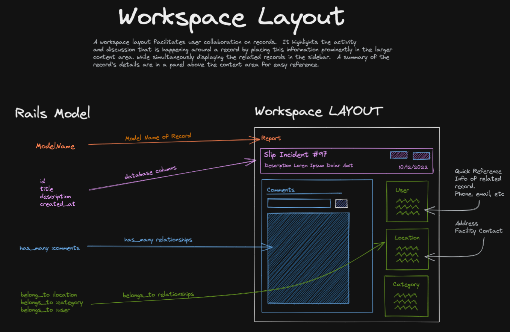
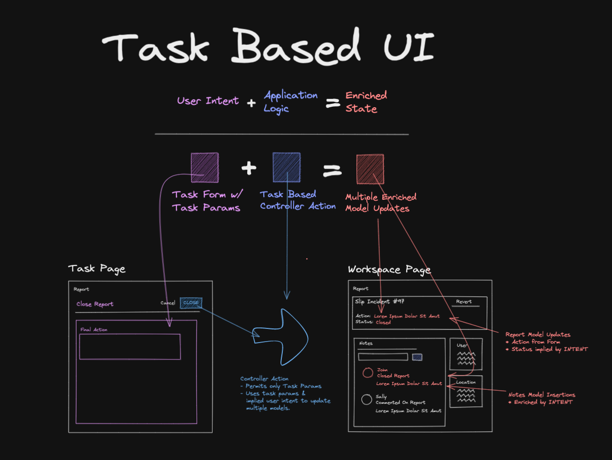

# Near Miss Reporting

## Demo

* https://near-miss-report.herokuapp.com/

* Users: 

  * Jake 1234abcd

  * John 1234abcd

  * Lindsy 1234abcd

  * Sunny 1234abcd

## Frameworks

* [Rails 7](https://guides.rubyonrails.org/index.html) - [API Mode](https://guides.rubyonrails.org/api_app.html)

* [Next.js 13](https://guides.rubyonrails.org/api_app.html) - Static Export

## Authentication

* ActionController::Cookies

## State Management

* [Jotai](https://jotai.org/) - Sharing state without Prop-Drilling

* [React Query](https://tanstack.com/query/v4) - Syncing state with Rails API

* [useState](https://reactjs.org/docs/hooks-state.html) - Localized UI state and form elements

* ~~Redux~~ We do NOT use redux, but we do use a reducer method to update state where server data on dashboard is being filtered by multiple checkboxes

## Style Design System

* [TailwindUI](https://tailwindui.com/) - Beautifully designed, expertly crafted components and templates, built by the makers of Tailwind CSS

* [Lightning Design System Layout Guidelines](https://www.lightningdesignsystem.com/guidelines/layout/) - Followed guidelines for Workspace Layout and Reference Layout.

* [Task Based UI](https://codeopinion.com/decomposing-crud-to-a-task-based-ui) - Moving from CRUD (Create, Read, Update Delete) based UI to a Task Based UI means creating a user interface that makes users' tasks explicit. Tasks (or actions, commands) are a way to guide a user into the specific actions they can take for a given state or workflow

## Tests

* Rspec

# Diagrams

